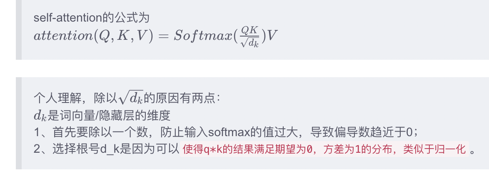

## 篇章小测
* 问题1: Transformer中的softmax计算为什么需要除以$d_k$?
  * Attention得分计算时是计算qk点积，维度越高点积结果越大，若不进行归一化直接softmax计算就会将几乎全部的概率分布都分配给了最大值对应的标签而其他值为0（梯度消失），不利于后续参数更新
  * 
* 问题2: Transformer中attention score计算时候如何mask掉padding位置？
  * 将mask位置的attention score 设置为$-\infin$
* 问题3: 为什么Transformer中加入了positional embedding？
  * 因为self-attention中是不考虑句子中单词的位置的，加入positional encoding 可以添加位置信息
* 问题4: BERT预训练时mask的比例，可以mask更大的比例吗？
  * 可以，但是不确定效果会不会变好，mask只是对预料中的部分单词进行随机mask处理，并预测某个mask掉的单词

* 问题5: BERT如何进行tokenize操作？有什么好处？
  * 大体分为两步：basic tokenize和WordPiece tokenziation。前者包括标点符号分隔、小写化、区分中文字符、清除无效字符等；后者则采用greedy longest-match-first算法对词进行进一步拆分，效果是区分出词根和前后缀。与选用完整单词作为token相比，WordPiece的方法可以可以更好地学习词根与词缀之间的关系，提取不同时态语态的关键信息。	
* 问题6: GPT如何进行tokenize操作？和BERT的区别是什么？
  * 分词方法不同
  * GPT2中采用的是BPE（Byte Pair Encoding）进行分词。BERT采用的WordPiece分词可以看作是BPE的变种。不同在于WordPiece基于概率生成新的subword而不是最高频字节对。
* 问题7: BERT模型特别大，单张GPU训练仅仅只能放入1个batch的时候，怎么训练？
  * [数据并行](https://www.zhihu.com/search?q=数据并行&search_source=Entity&hybrid_search_source=Entity&hybrid_search_extra={"sourceType"%3A"answer"%2C"sourceId"%3A2221939093}) 
  *  算子拆分
    * 单个矩阵乘法可以分到两个device上计算
  * 流水并行
    * 将不同的Layer切分到不同的Device上，就可以形成Pipeline方案
* 问题8: Transformer为什么需要一个position embedding？
* 问题9: Transformer中的残差网络结构作用是什么？
  * 当网络层数增加时，神经网络在训练集上的准确率出现饱和甚至下降的现象，即退化。加入残差网络结构可以有效避免这种情况。
* 问题10: BERT训练的时候mask单词的比例可以特别大（大于80%）吗？
  * 可以，但是效果会变差
* 问题11: BERT预训练是如何做mask的？
  * 按照15%比例mask掉部分词，然后这15%的词中80%用mask，10%用原词，10%随机替换。
* 问题11: word2vec到BERT改进了什么？
  * 主要是针对不同语境下词语会有不同含义这一问题进行了改进。